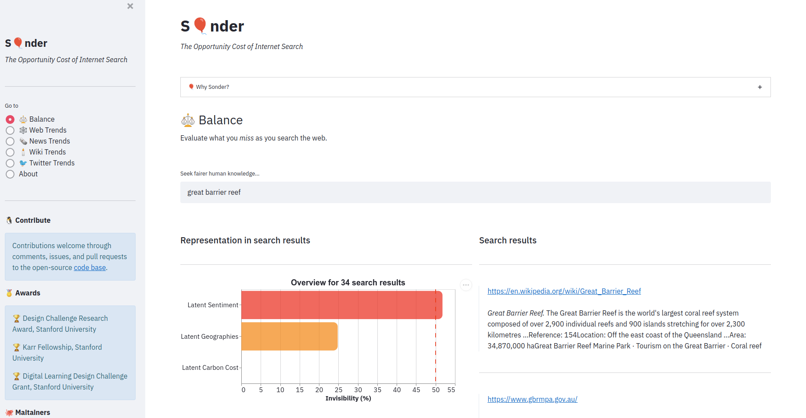
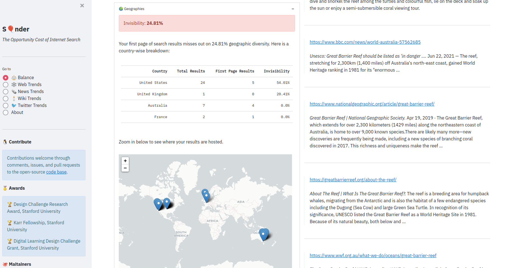
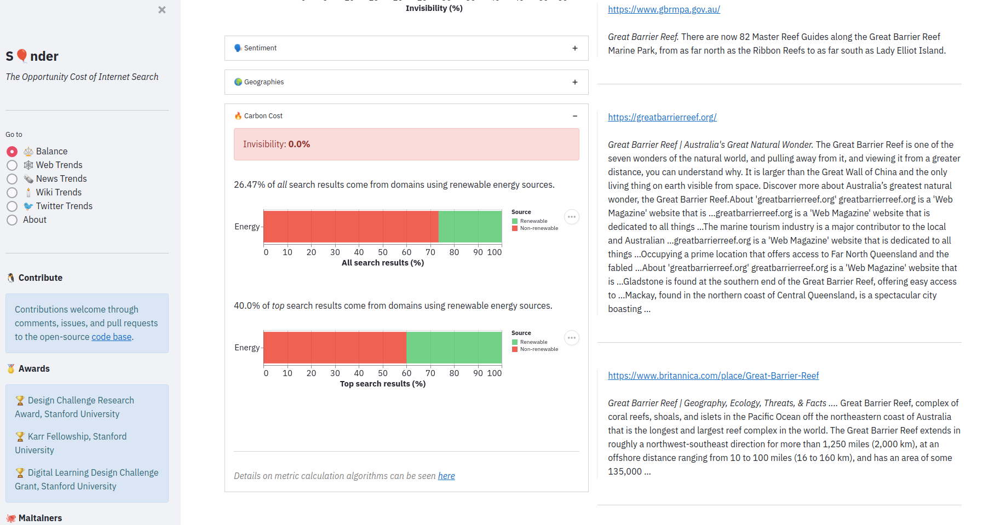
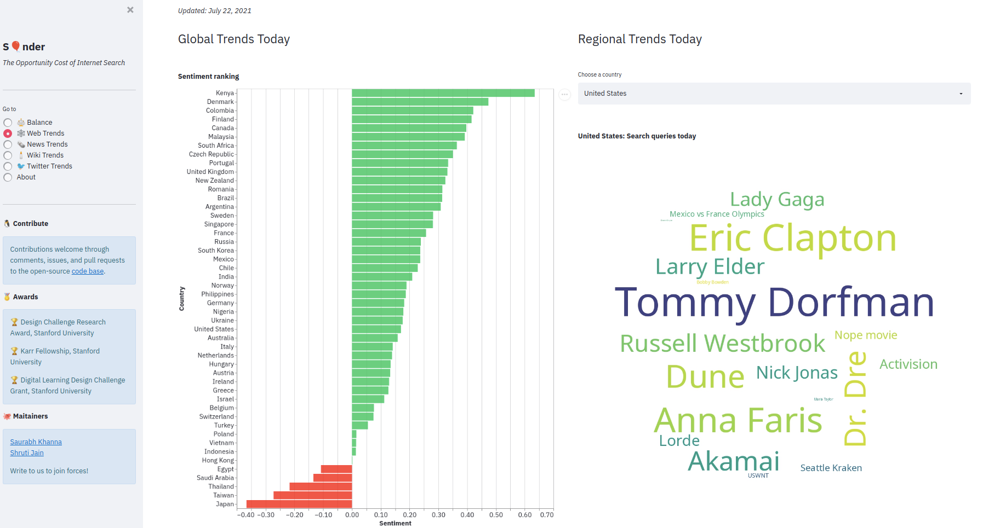

# S🎈nder

 

> _sonder (n.)_
>
> the realization that each random passerby is living a life as vivid and complex as your own[1](#f1)

 

## ⚡ TL;DR

Internet search shows you what you consume. Sonder shows you what you miss out on. We assess the opportunity cost of internet search.

Our access to knowledge is biased by ~~public~~ private algorithms, trained on ~~diverse~~ mainstream data, intended to maximize ~~representation~~ consumption. This robs us of the choice to understand those who think and learn differently. Sonder is an attempt to make our lack of choice explicit. To at least be mindful of our filter bubbles, if not break them.

Our work spans two dimensions:

-   ⚖️ *Balance*: Assess latent/invisible knowledge as you search the web. Balance relevance with diversity.
-   📣 *Trends*: Highlight fairness in global web, news, wiki, and social media trends.

 

## 👀 Glimpses

### ⚖️ Balance

#### Latent knowledge summary for search query

  

 

#### Latent sentiment

  

 

#### Latent geographies

  

 

#### Latent carbon cost

  

 

### 📣 Trends

#### Global sentiment trends (Web search)

  

 

#### Global sentiment trends (News search)

  

 

## 🧮 Algorithms

Details [here](https://raw.githubusercontent.com/sonder-labs/sonder/main/slides_sonder.pdf).

 

## 🏆 Awards

-   Stanford Institute for Human-Centered Artificial Intelligence Fellowship
-   Stanford Data Science Scholarship
-   Design Challenge Research Award, Stanford University
-   Karr Fellowship, Stanford University
-   Digital Learning Design Challenge Grant, Stanford University

 

## 👾 Maintainer

-   [Saurabh Khanna](mailto:saurabhkhanna@stanford.edu)

Sonder is [open-source](https://github.com/sonder-labs/sonder/blob/main/LICENSE) and envisioned as a nonprofit. [Reach out](mailto:saurabhkhanna@stanford.edu) to join forces.

Contribution covenant [here](https://github.com/sonder-labs/sonder/blob/main/CODE_OF_CONDUCT.md).

 

* * *

<b id="f1">1</b> Diction credit: [John Koenig](https://www.ted.com/speakers/john_koenig) [↩](#a1)
