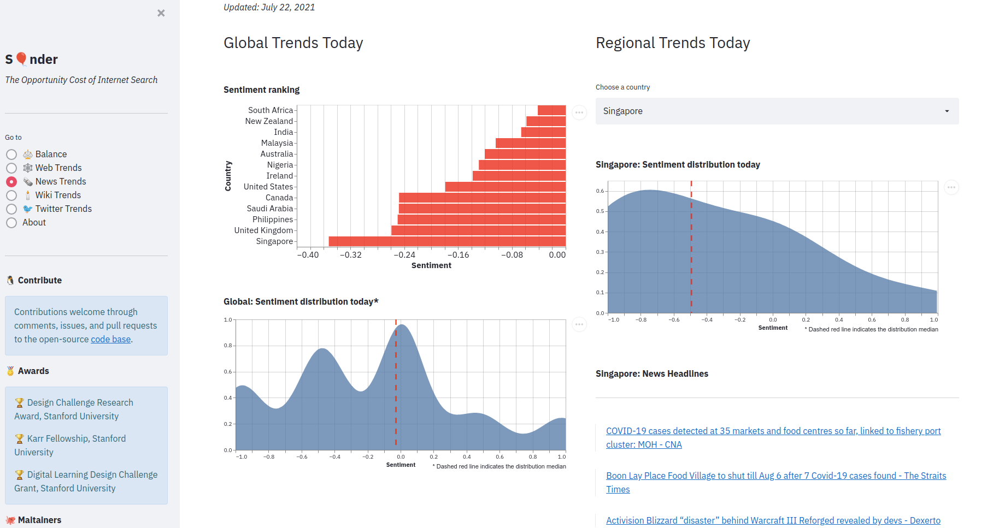

# S🎈nder

> *sonder (n.)*
>
>> the realization that each random passerby is living a life as vivid and complex as your own
>
> &mdash; John Koenig, The Dictionary of Obscure Sorrows

## ⚡ TL;DR

Internet search shows you what you consume. Sonder shows you what you miss out on. We assess the opportunity cost of internet search.

Our access to knowledge is biased by ~~public~~ private algorithms, trained on ~~diverse~~ mainstream data, intended to maximize ~~understanding~~ consumption. This robs us of the choice to understand those who think and learn differently. Sonder is an attempt to make our lack of choice explicit. To at least be mindful of our filter bubbles, if not break them.

We are working along two dimensions:

+ ⚖️ Balance: Assess latent/hidden knowledge as you search the web. Balance relevance with diversity.
+ 📣 Trends: Highlight fairness in web, news, wiki, and social media trends.

 

## 👀 Glimpses

Latent knowledge summary for search query:

  

 

Latent sentiment:

  

 

Latent geographies:

  

 

Latent carbon cost:

  

 

Global sentiment trends (Web search):

  

 

Global sentiment trends (News search):

  

## 🧮 Algorithms

Details [here](https://github.com/sonder-labs/sonder).
